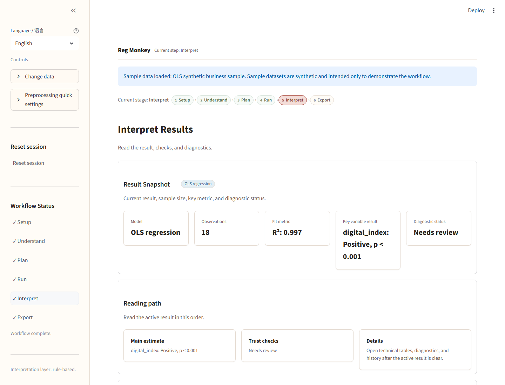
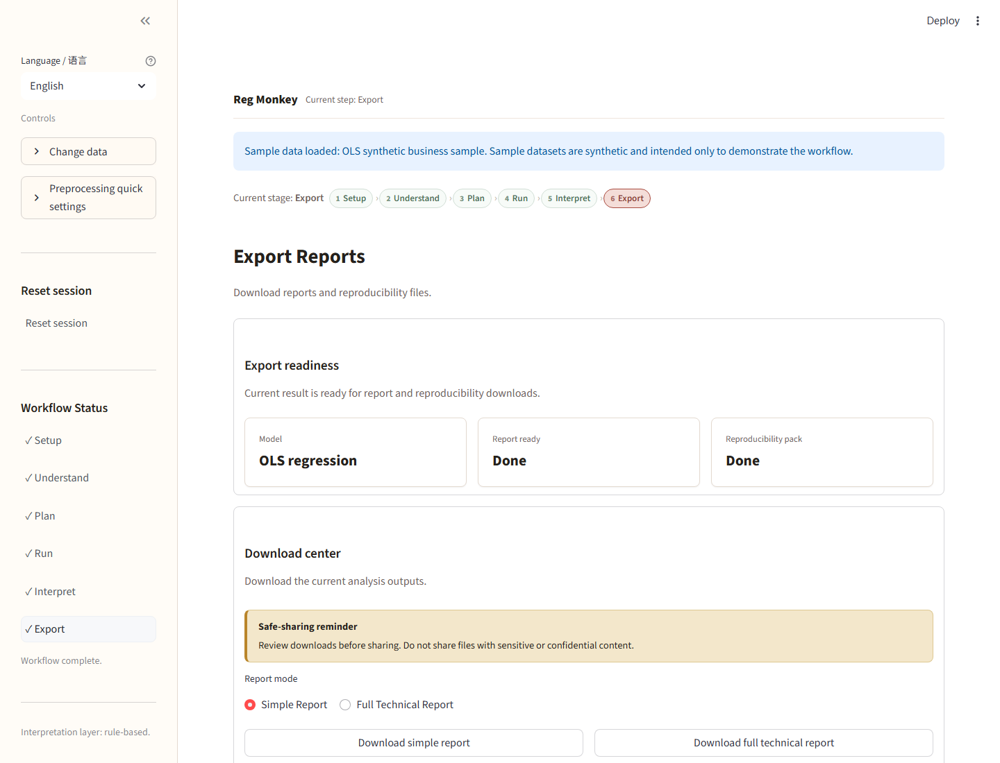

# Reg Monkey

Reg Monkey is a bilingual empirical analysis assistant for business, economics, and management research workflows.

It helps users inspect data, configure deterministic statistical models, read diagnostics, and export reports. It supports English and Chinese UI/report wording and includes synthetic sample datasets for demo workflows.

[中文说明](README.zh.md)


## What it does

- Upload CSV or Excel data, or start with built-in synthetic sample datasets.
- Inspect data quality, missingness, variable roles, and resource warnings before modeling.
- Configure and run OLS, Logit, Probit, Panel Fixed Effects, DID, IV/2SLS, and PSM workflows.
- Keep DID, IV/2SLS, and PSM as guarded manual research-design workflows.
- Export brief reports, full technical reports, and reproducibility packs.

Reg Monkey does not prove causality, rank models automatically, or replace econometric judgment.

## Run locally

```bash
python -m venv .venv
.venv\Scripts\activate
pip install -r requirements.txt
streamlit run app.py
```

On macOS/Linux:

```bash
python -m venv .venv
source .venv/bin/activate
pip install -r requirements.txt
streamlit run app.py
```

## Streamlit demo setup

Use `app.py` as the Streamlit entrypoint.

For public-demo mode, set:

```text
REG_MONKEY_PUBLIC_DEMO_MODE=true
```

No API keys, login system, database, telemetry service, or external LLM provider is required for the demo.

## Sample workflow

1. Open the app and choose a synthetic sample dataset.
2. Confirm preprocessing and variable roles.
3. Review the Understand Data dashboard.
4. Use the recommended setup or manually configure a model.
5. Run the model after reviewing pre-run risks.
6. Read the result snapshot, beginner guide, diagnostics, and cautions.
7. Export a brief report, full report, or reproducibility pack.



## Supported model families

| Family | Status | Notes |
|---|---:|---|
| OLS | Supported | Continuous-outcome regression with diagnostics and report export. |
| Logit | Supported | Binary-outcome model; raw coefficients are not probability-point changes by default. |
| Probit | Supported | Binary-outcome model with family-specific fit metrics. |
| Panel Fixed Effects | Supported | Uses within-entity variation; time-invariant differences are absorbed. |
| DID | Guarded manual workflow | Requires research-design confirmation, especially parallel-trends reasoning. |
| IV/2SLS | Guarded manual workflow | Requires instrument relevance and exclusion-restriction judgment. |
| PSM | Guarded manual workflow | Balances observed covariates only; unobserved confounding may remain. |

## Demo boundaries

- Use synthetic sample data first.
- Do not upload sensitive, confidential, or personal data to a public demo.
- Hosted resource limits apply; use small cleaned files.
- Review exported content before sharing.


