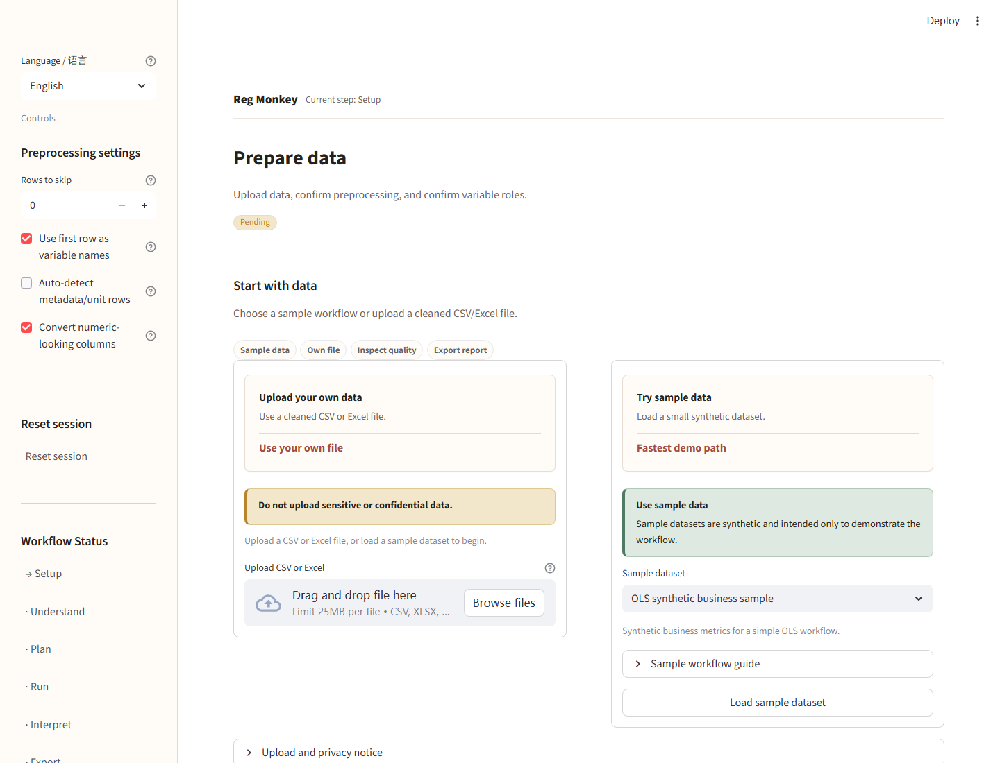

# Reg Monkey

Reg Monkey is a bilingual empirical analysis assistant for business, economics, and management research workflows.

Reg Monkey 是一个面向商科、经济学和管理学研究流程的双语实证分析助手。

## Choose a language / 选择语言

- [English](README.en.md)
- [中文](README.zh.md)

| English | 中文 |
|---|---|
|  |  |

## Public demo note / 公开演示说明

Use the built-in synthetic sample data first. Do not upload sensitive, confidential, or personal data to public demo environments. Results are statistical estimates and should not be treated as automatic causal conclusions.

建议先使用内置合成示例数据。不要在公开演示环境上传敏感、机密或个人数据。结果是统计估计，不应被视为自动因果结论。
