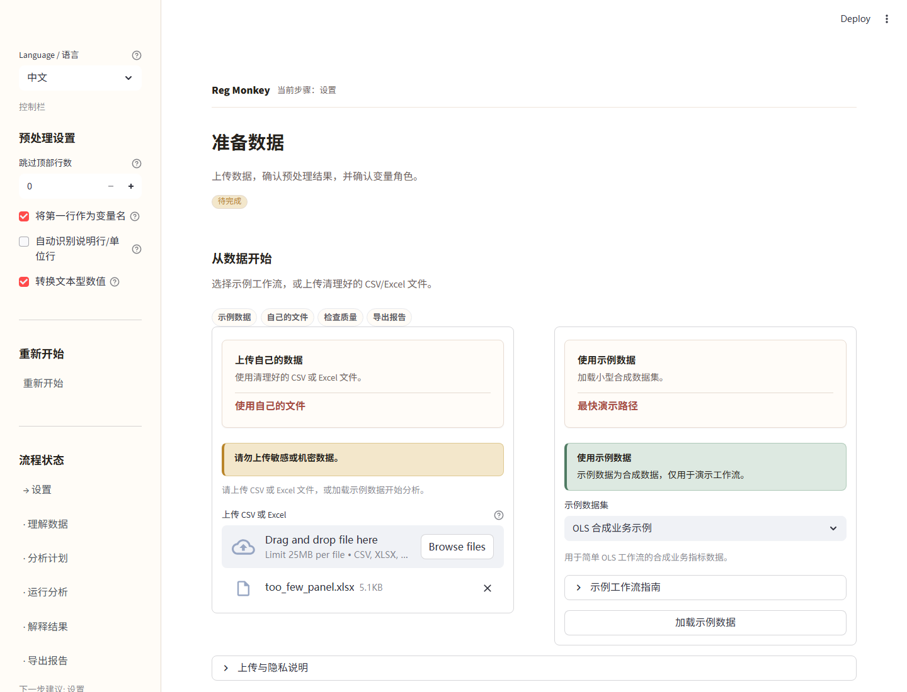
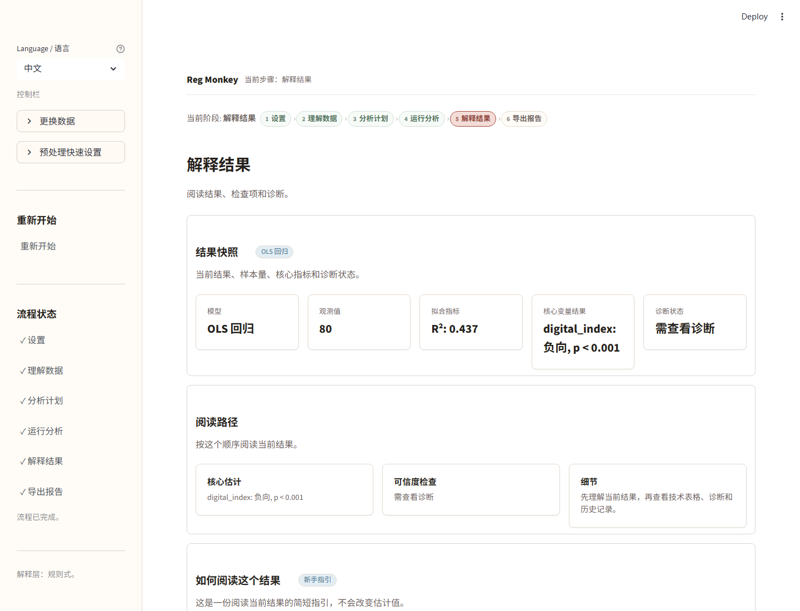
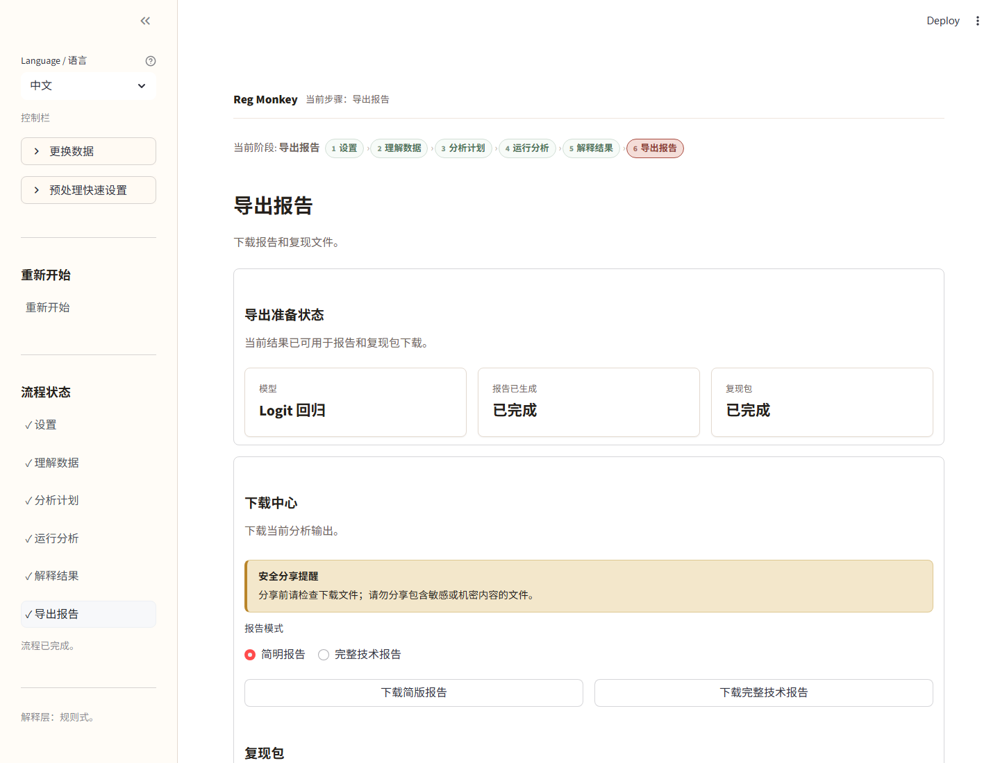

# Reg Monkey

Reg Monkey 是一个面向商科、经济学和管理学研究流程的双语实证分析助手。

它帮助用户检查数据、配置确定性的统计模型、阅读诊断结果，并导出报告。应用支持中文和英文界面/报告文案，并内置合成示例数据用于演示工作流。

[English README](README.en.md) | [中文使用手册](USER_GUIDE.zh.md)



## 它可以做什么

- 上传 CSV 或 Excel 数据，也可以先使用内置合成示例数据。
- 在建模前检查数据质量、缺失情况、变量角色和资源提示。
- 配置并运行 OLS、Logit、Probit、面板固定效应、DID、IV/2SLS 和 PSM 工作流。
- 将 DID、IV/2SLS 和 PSM 保持为带保护提示的手动研究设计流程。
- 导出简版报告、完整技术报告和可复现压缩包。

Reg Monkey 不证明因果关系，不自动给模型排序，也不替代计量经济学判断。

## 快速试用

第一次使用时，建议从 “OLS 合成业务示例” 开始。

1. 加载示例数据。
2. 确认预处理结果和变量角色。
3. 检查数据质量。
4. 应用推荐方案，或手动配置模型。
5. 运行模型。
6. 阅读结果和诊断。
7. 导出报告或可复现压缩包。



完整操作说明请看 [中文使用手册](USER_GUIDE.zh.md)。

## 本地运行

```bash
python -m venv .venv
.venv\Scripts\activate
pip install -r requirements.txt
streamlit run app.py
```

macOS/Linux:

```bash
python -m venv .venv
source .venv/bin/activate
pip install -r requirements.txt
streamlit run app.py
```

## Streamlit 演示设置

Streamlit 入口文件使用：

```text
app.py
```

公开演示模式设置：

```text
REG_MONKEY_PUBLIC_DEMO_MODE=true
```

演示不需要 API key、登录系统、数据库、遥测服务或外部托管模型服务。

## 支持的模型类型

| 模型类型 | 状态 | 说明 |
|---|---:|---|
| OLS | 已支持 | 连续结果变量回归，包含诊断和报告导出。 |
| Logit | 已支持 | 二元结果模型；原始系数默认不是概率百分点变化。 |
| Probit | 已支持 | 二元结果模型，使用对应的拟合指标。 |
| 面板固定效应 | 已支持 | 使用个体内部变化；不随时间变化的差异会被吸收。 |
| DID | 受保护的手动流程 | 需要研究设计确认，尤其是平行趋势判断。 |
| IV/2SLS | 受保护的手动流程 | 需要判断工具变量相关性和排除限制。 |
| PSM | 受保护的手动流程 | 只能平衡可观测协变量，未观测混杂仍可能存在。 |

## 演示边界

- 建议先使用合成示例数据。
- 不要在公开演示环境上传敏感、机密或个人数据。
- 托管环境存在资源限制；请使用小型、清理过的文件。
- 分享前请先检查导出内容。


